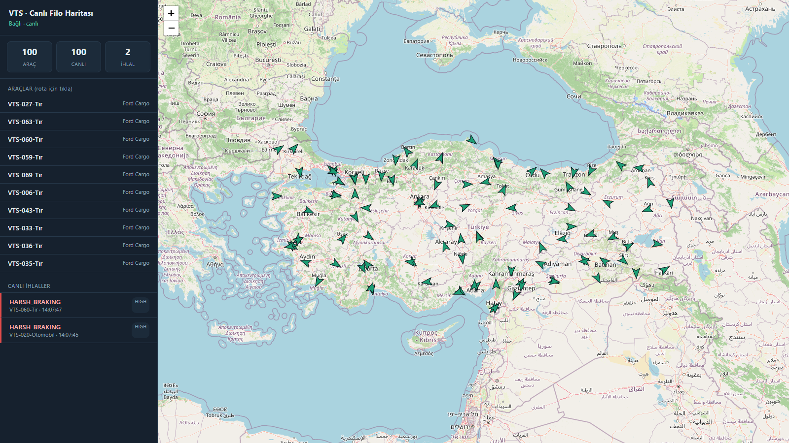
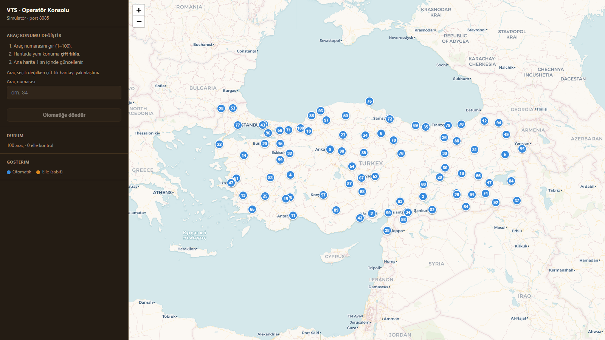
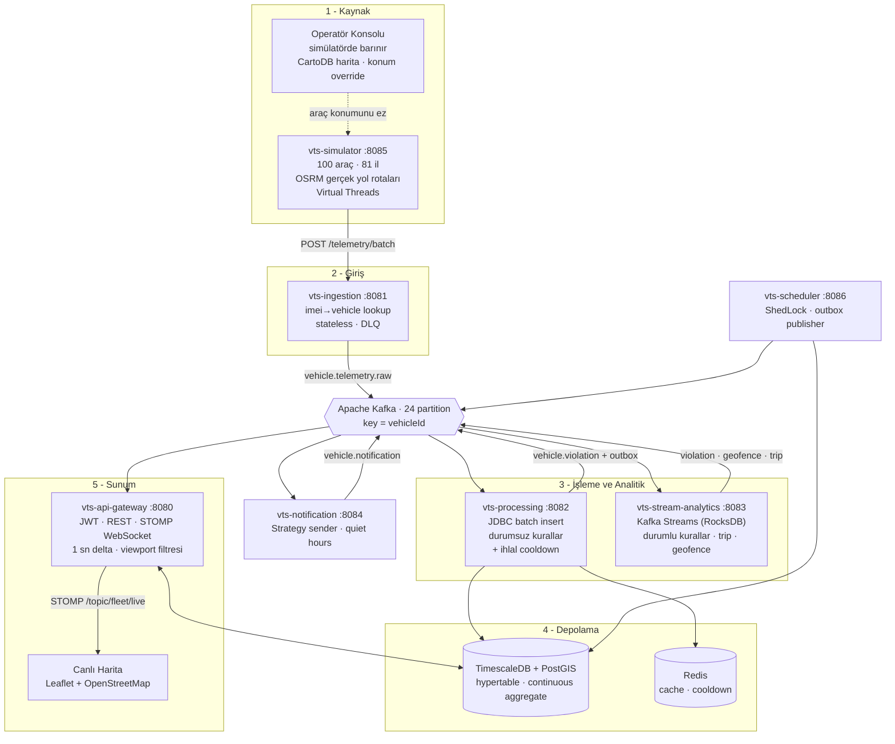

# Araç Takip Sistemi (Vehicle Tracking Simulation)

Olay tabanlı (event-driven) filo telematik platformu. Simüle edilen araç cihazlarından
gelen telemetri; **ingestion → Kafka → işleme/analitik → bildirim → API ağ geçidi**
hattı boyunca akar ve **gerçek harita üzerinde canlı** izlenir.

- **Tasarım hedefi:** 1000 araç, ~1000 mesaj/saniye, günde ~86M satır.
- **Çalışma (dev) hedefi:** Türkiye geneli 100 araç, 1 sn tick.
- **İlke:** Ölçek yalnızca konfigürasyondan gelir; mimari baştan doğru kurulur.

Teknoloji: **Java 21 · Spring Boot 3.3 · Apache Kafka (KRaft) · Kafka Streams ·
TimescaleDB + PostGIS · Redis · Leaflet · çok modüllü Maven monorepo.**

---

## Ekran görüntüleri

### Canlı Filo Haritası — `:8080`
Gerçek OpenStreetMap üzerinde 100 aracın canlı takibi. Araçlar **gerçek yollarda**
ilerler (OSRM rotaları), yönlerine göre döner; ihlaller anlık olarak sağ panele düşer
ve ilgili araç kırmızıya boyanır.



### Operatör Konsolu — `:8085`
Ayrı sunucuda (simülatör servisi), **farklı harita** (CartoDB) ile çalışan kontrol
paneli. Araç numarası girip haritaya **çift tıklayarak** aracı taşıyabilirsiniz —
değişiklik gerçek telemetri hattından geçip **1 sn içinde ana haritaya yansır**.



---

## Mimari

Veri, soldan sağa tek yönlü akar. **Operatör konsolu** ise geri besleme döngüsünü
kapatır: simülatördeki konumu değiştirir, o da normal hattan tekrar haritaya ulaşır.



### Kritik akış: operatörden haritaya
Simülatör, filonun **tek konum kaynağıdır**. Bu yüzden konsoldan yapılan bir taşıma
sahte bir "harita hilesi" değil, gerçek boru hattından geçen gerçek bir telemetridir:

```
Operatör çift tık  →  Simülatör (manuel override)  →  Ingestion  →  Kafka
                                                                      ↓
                    Ana Harita  ←  STOMP (1 sn)  ←  Gateway  ←  Processing
```

---

## Modüller

| Modül | Port | Sorumluluk |
|---|---|---|
| `vts-common` | — | Event modelleri, topic sabitleri, enum'lar, TenantContext |
| `vts-simulator` | 8085 | Filo simülatörü (Virtual Threads), OSRM yol rotaları **+ Operatör Konsolu UI** |
| `vts-ingestion-service` | 8081 | Stateless HTTP giriş; imei→vehicle lookup (Caffeine→Redis→DB), Kafka publish, DLQ |
| `vts-processing-service` | 8082 | Batch consumer; JDBC batch insert, durumsuz kurallar **+ ihlal cooldown**, outbox |
| `vts-stream-analytics` | 8083 | Kafka Streams; durumlu kurallar (sert fren, sürekli hız, rölanti, geofence, trip) |
| `vts-notification-service` | 8084 | Strategy sender'lar, cooldown (Redis), quiet hours |
| `vts-api-gateway` | 8080 | JWT güvenlik, REST, STOMP WebSocket, şema sahibi (Flyway) **+ Canlı Harita UI** |
| `vts-scheduler-service` | 8086 | ShedLock jobs: offline tespiti, skorlama, bakım, outbox publisher |

---

## Filo modeli

### Türkiye geneli dağılım
100 araç, **81 ilin tamamına** nüfusa göre ağırlıklandırılarak dağıtılır:

| İl grubu | Araç | Örnek |
|---|---|---|
| En büyük 3 metropol | 3'er | İstanbul, Ankara, İzmir |
| Sonraki 13 büyükşehir | 2'şer | Bursa, Antalya, Adana, Konya, Gaziantep… |
| Kalan 65 il | 1'er | Sinop, Ardahan, Yalova… |

### Araç tipleri, plakalar ve hız sınırları
Plaka, tipi de taşır: `VTS-001-Otomobil`, `VTS-027-Tır`, `VTS-063-Motor`.

| Tip | Adet | Hız sınırı | Nasıl uygulanır |
|---|---|---|---|
| Otomobil | 50 | **110** km/s | `rule_assignment` GROUP override |
| Motor | 20 | **90** km/s | `rule_assignment` GROUP override |
| Tır | 30 | **80** km/s | temel `SPEED_LIMIT` eşiği |

Her araca açılışta **rastgele 0–120 km/s** taban seyir hızı atanır; sınırı aşan araç
ihlal üretir (aşağıdaki cooldown'a tabi).

### Gerçek yol takibi (OSRM)
Açılışta her il için OSRM'den gerçek bir **sürüş rotası** çekilir; araçlar bu yola
oturmuş polyline üzerinde ilerler — araziden/denizden geçmezler. OSRM'e ulaşılamazsa
sistem otomatik olarak sentetik döngülere düşer (3 başarısız denemeden sonra vazgeçer),
yani internet olmadan da ayakta kalır.

---

## Ölçek kısıtları (baştan doğru kurulan kararlar)

1. **Telemetri tekil `save()` ile yazılmaz** — batch Kafka consumer + `JdbcTemplate.batchUpdate()` + `ON CONFLICT DO NOTHING`; telemetri için JPA entity yok; `reWriteBatchedInserts=true`.
2. **Event başına Redis round-trip yok** — durumlu state Kafka Streams state store (RocksDB); toplu Redis işlemleri pipeline.
3. **WebSocket'e event başına mesaj yok** — gateway in-memory tutar, `@Scheduled(1s)` ile SADECE değişenleri (delta) yayınlar; client viewport (bbox) gönderir.
4. **İhlaller okuma başına üretilmez** — araç+kural bazlı **cooldown** ile debounce edilir: sürekli hız aşan bir araç, kuralın `cooldown_seconds` penceresinde tek ihlal üretir. Bu, ihlal hacmini telemetri hızıyla değil **ayrık olaylarla** orantılı tutar (ölçülen etki: ~20 ihlal/sn → ~0.07/sn).
5. **Kafka partition = 24** (profilden bağımsız) — sonradan artırmak per-vehicle ordering'i ve Streams state store'larını bozar.
6. **Telemetri = TimescaleDB hypertable** — dashboard sorguları ham tabloya değil continuous aggregate'e vurur.
7. **Her tabloda `tenant_id` + Outbox Pattern** baştan.

---

## Veri modeli

Flyway `V1`–`V15` ile **38 iş tablosu**. Öne çıkanlar:
- `telemetry` **hypertable**: `by_range(ts)` + `by_hash(vehicle_id, 8)`, PK `(vehicle_id, ts)`, FK'siz (batch insert hızı).
- `violation` **hypertable**.
- `vehicle_driver_assignment`: ihlali doğru şoföre atfetmek için zamansal kayıt.
- `rule` + `rule_assignment`: eşikler asla kodda değil; TENANT/GROUP kapsamında override edilir (tip bazlı hız sınırları buradan gelir).
- Continuous aggregate'ler: `telemetry_1min`, `telemetry_hourly`, `violation_daily_summary`.
- Kompresyon + retention politikaları, GIST/BRIN/partial index'ler.

---

## Çalıştırma

Tüm sistem tek komutla (altyapı + 8 servis):

```bash
docker compose up -d --build
```

Ardından tarayıcıdan:

| Arayüz | Adres | Giriş |
|---|---|---|
| **Canlı Filo Haritası** | http://localhost:8080 | `admin` / `password` |
| **Operatör Konsolu** | http://localhost:8085 | — |
| Swagger UI | http://localhost:8080/swagger-ui.html | JWT |
| Kafka UI | http://localhost:8090 | — |
| Prometheus | http://localhost:9090 | — |
| Grafana | http://localhost:3000 | `admin` / `admin` |

Diğer portlar: ingestion 8081, processing 8082, stream-analytics 8083,
notification 8084, scheduler 8086, **Postgres 5433**, Redis 6379.

> Postgres host portu **5433**'tür (5432'de çalışan yerel bir PostgreSQL ile
> çakışmasın diye). Servisler kendi aralarında `postgres:5432` kullanmaya devam eder.

Yük profili (1000 araç / 1 sn, 3 broker override):

```bash
docker compose -f docker-compose.yml -f docker-compose.load.yml up -d
```

### API örnekleri

```bash
# Giriş (dev kullanıcı: admin / password)
TOKEN=$(curl -s -X POST localhost:8080/api/v1/auth/login \
  -H 'Content-Type: application/json' \
  -d '{"username":"admin","password":"password"}' | jq -r .token)

curl localhost:8080/api/v1/vehicles            -H "Authorization: Bearer $TOKEN"
curl localhost:8080/api/v1/live/positions      -H "Authorization: Bearer $TOKEN"
curl localhost:8080/api/v1/dashboard/summary   -H "Authorization: Bearer $TOKEN"
curl "localhost:8080/api/v1/violations?limit=20" -H "Authorization: Bearer $TOKEN"
```

Canlı harita WebSocket (STOMP): `ws://localhost:8080/ws` →
`/topic/fleet/live`, `/topic/violations`, `/user/queue/notifications`;
viewport için `/app/viewport`.

### Operatör konsolu API (simülatör, :8085)

```bash
curl localhost:8085/api/positions                       # tüm araçların anlık konumu
curl -X POST localhost:8085/api/control/34/position \
  -H 'Content-Type: application/json' -d '{"lat":39.92,"lon":32.85}'   # aracı taşı
curl -X DELETE localhost:8085/api/control/34/position   # otomatiğe döndür
```

---

## Profiller

| Profil | Araç | Tick | Chunk | Retention |
|---|---|---|---|---|
| `dev` (varsayılan) | 100 (81 ile dağıtılmış) | 1 sn | 1 gün | 30 gün |
| `load` | 1000 | 1 sn | 1 saat | 7 gün |
| `prod` | dış konfig | — | — | — |

---

## Test

- **Kafka Streams:** `TopologyTestDriver` (harsh braking, idling, geofence enter/exit, trip).
- **Birim testler:** kural motoru **+ ihlal cooldown penceresi**, ingestion routing, notification cooldown/quiet-hours, JWT, live-map delta+viewport, simülatör hareketi ve hız modeli.
- **Şema doğrulama:** JPA entity'ler canlı TimescaleDB'ye karşı `ddl-auto=validate` (Testcontainers).
- **Uçtan uca:** simulator → Kafka → DB akışı gerçek konteynerlerde doğrulandı (telemetri, last position, ihlaller, tip bazlı eşik override'ı, şoför atfı, operatör override'ının ana haritaya yansıması).

```bash
mvn test
```

---

## Gözlemlenebilirlik

Micrometer + Prometheus + Grafana. Metrikler: `telemetry.ingested`,
`telemetry.persisted`, `violation.produced`, `notification.sent`, consumer lag,
DLQ oranı. Grafana'da hazır **"VTS — Fleet Telematics Overview"** dashboard'u
otomatik yüklenir. Her olayda `correlationId` ile yapılandırılmış JSON log.
