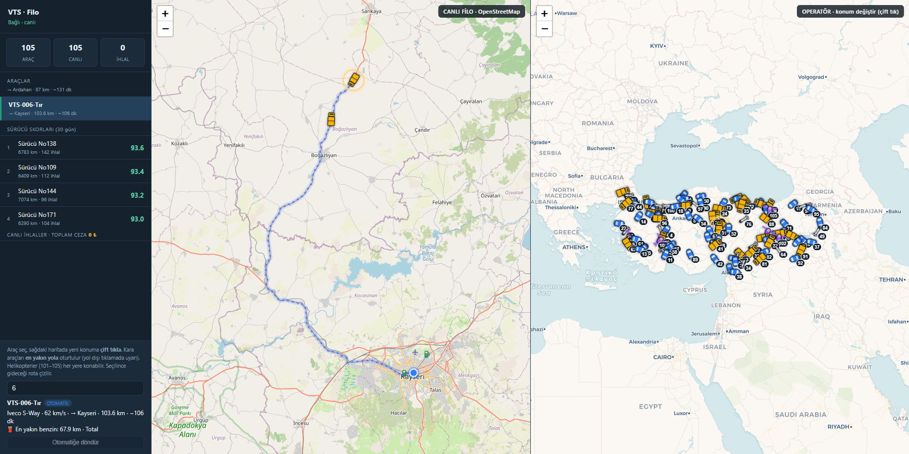
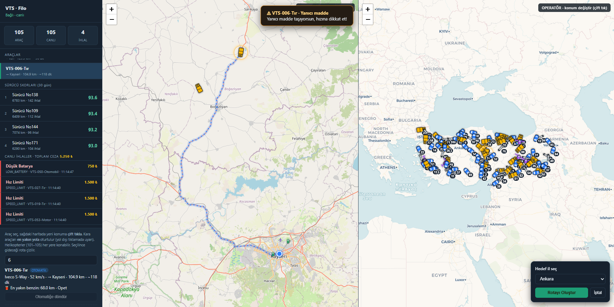
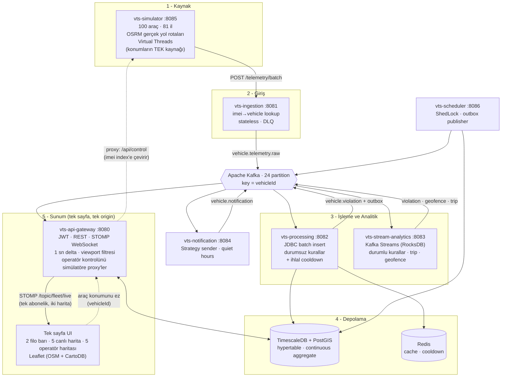

# Araç Takip Sistemi (Vehicle Tracking Simulation)

Olay tabanlı (event-driven) filo telematik platformu. Simüle edilen araç cihazlarından
gelen telemetri; **ingestion → Kafka → işleme/analitik → bildirim → API ağ geçidi**
hattı boyunca akar ve **gerçek harita üzerinde canlı** izlenir.

- **Tasarım hedefi:** 1000 araç, ~1000 mesaj/saniye, günde ~86M satır.
- **Çalışma (dev) hedefi:** Türkiye geneli 100 araç, 1 sn tick.
- **İlke:** Ölçek yalnızca konfigürasyondan gelir; mimari baştan doğru kurulur.

Teknoloji: **Java 21 · Spring Boot 3.3 · Apache Kafka (KRaft) · Kafka Streams ·
TimescaleDB + PostGIS · Redis · Leaflet · çok modüllü Maven monorepo.**

---

## Ekran görüntüsü

Tek sayfa, tek servis (`:8080`), **12'lik grid: 2 filo barı · 5 canlı harita · 5 operatör haritası**.



- **Sol (2/12) — Filo barı:** araç listesi, sürücü skorları, canlı ihlaller, seçim ve kontrol kutusu.
- **Orta (5/12) — Canlı harita** (OpenStreetMap): 105 araç **gerçek yollarda** (OSRM rotaları).
  Her araç **tipine göre renkli logo** ile gösterilir — otomobil (mavi) · tır (sarı) · motor
  (beyaz) · helikopter (mor) — gittiği yöne döner; ihlalde kırmızıya boyanır. Haritada
  **benzin istasyonları** (⛽) da işaretlidir. Bir araç seçilince **gideceği rota** akan
  kesikli çizgiyle çizilir ve **en yakın benzin istasyonu mesafesi** gösterilir.
- **Sağ (5/12) — Operatör haritası** (CartoDB): aracı seç, yeni konuma **çift tıkla**.
  Kara aracı yalnızca **yol üzerine** taşınabilir; yol dışına tıklanırsa *"bu noktaya
  gidilemiyor"* uyarısı çıkar ve araç **yerinde kalır**. Helikopterler her yere konabilir.
  Taşınan araç **durmaz**: bırakıldığı noktadan **yeni bir hedefe** kendi hızıyla yola çıkar.
  Değişiklik gerçek telemetri hattından geçip **~0.1 sn içinde sol haritaya** yansır.
- **İhlaller** Türkçe adı ve **TL cinsinden cezasıyla** listelenir; toplam ceza barın üstünde
  görünür. Araçların çoğu limitlere uyduğu için akış seyrektir (saniyeler içinde sel değil).

### Operatör: rota oluşturma ve araç uyarıları




- **Rota Oluştur:** Araç seçilince operatör haritasının sağ altında bir buton çıkar; **hedef
  il** seçilir ve araç oraya doğru yeni bir rotaya (kara aracı OSRM yolu, helikopter düz uçuş)
  yönlendirilir — değişiklik anında sol haritaya yansır.
- **Araç uyarıları:** Operatör bir araca **metin uyarısı** gönderebilir (🔥 yanıcı madde,
  📦 kırılacak eşya, ❄️ soğuk zincir, ⚠️ hıza dikkat…). Uyarı kalıcıdır (araca tıklanınca
  görünür) ve tüm operatörlere **anlık bildirim** (toast) olarak WebSocket'ten gider.

Her iki harita **tek bir WebSocket aboneliğinden** beslenir — polling yok.

---

## Mimari

Veri tek yönlü akar. **Operatör haritası** geri besleme döngüsünü kapatır: gateway
üzerinden simülatördeki konumu ezer, o konum da normal hattan geçip haritaya döner.
UI'ın tamamı tek serviste (gateway) barınır — ikinci bir frontend servisi yoktur.



### Kritik akış: operatörden haritaya
Simülatör, filonun **tek konum kaynağıdır**. Bu yüzden operatör haritasından yapılan
bir taşıma sahte bir "harita hilesi" değil, gerçek boru hattından geçen gerçek bir
telemetridir — ve override anında yayınlanır (bir sonraki tick beklenmez):

```
Sağ haritada çift tık → Gateway (proxy) → Simülatör (override + anında yayın)
                                                        ↓
                                                    Ingestion → Kafka
                                                        ↓
      Sol harita  ←  STOMP delta  ←  Gateway  ←  Processing        ~0.1 sn
```

> **Kimlik tuzağı:** `vehicle.id` ile plaka numarası **aynı değildir** — araçlar, tipleri
> serpiştirmek için hash sırasıyla seed edilir, identity id'leri plaka numarasına oturmaz.
> Bu yüzden UI her yerde `vehicleId` konuşur; simülatörün cihaz index'ine çeviriyi gateway
> **imei (doğal anahtar)** üzerinden yapar. Aksi halde operatör "7"yi taşıdığında haritada
> bambaşka bir araç hareket eder.

---

## Modüller

| Modül | Port | Sorumluluk |
|---|---|---|
| `vts-common` | — | Event modelleri, topic sabitleri, enum'lar, TenantContext, ortak Kafka tüketici desteği (deserialization + retry/DLQ politikası) |
| `vts-simulator` | 8085 | Filo simülatörü (Virtual Threads), OSRM yol rotaları, konum override API'si (UI sunmaz) |
| `vts-ingestion-service` | 8081 | Stateless HTTP giriş; imei→vehicle lookup (Caffeine→Redis→DB), Kafka publish, DLQ |
| `vts-processing-service` | 8082 | Batch consumer; JDBC batch insert, durumsuz kurallar **+ ihlal cooldown**, outbox |
| `vts-stream-analytics` | 8083 | Kafka Streams; durumlu kurallar (sert fren, sürekli hız, rölanti, geofence, trip) |
| `vts-notification-service` | 8084 | Strategy sender'lar, cooldown (Redis), quiet hours |
| `vts-api-gateway` | 8080 | JWT güvenlik, REST, STOMP WebSocket, şema sahibi (Flyway) **+ tek sayfa UI (iki harita)** + operatör kontrol proxy'si |
| `vts-scheduler-service` | 8086 | ShedLock jobs: offline tespiti, skorlama, bakım, outbox publisher |

---

## Filo modeli

### Türkiye geneli dağılım
100 kara aracı, **81 ilin tamamına** nüfusa göre ağırlıklandırılarak dağıtılır (+ 5 helikopter = 105):

| İl grubu | Araç | Örnek |
|---|---|---|
| En büyük 3 metropol | 3'er | İstanbul, Ankara, İzmir |
| Sonraki 13 büyükşehir | 2'şer | Bursa, Antalya, Adana, Konya, Gaziantep… |
| Kalan 65 il | 1'er | Sinop, Ardahan, Yalova… |

### Kategoriler ve araç tipleri
Filo bir **taksonomi** ile modellenir (`vehicle_category` + `vehicle_type` tabloları):

| Kategori | Tipler | Adet |
|---|---|---|
| **Kara Araçları** (`LAND`) | Otomobil, Tır, Motor | 50 / 30 / 20 |
| **Hava Araçları** (`AIR`) | Helikopter | 5 |
| **Deniz Araçları** (`SEA`) | — | 0 |

`SEA` bilerek boş: taksonomi, bir deniz filosunun ifade edilebilir olduğunu henüz tek bir
tekne yokken söyleyebilsin diye kayıtlı. `GET /api/v1/vehicle-types` kategorileri boş
olanlar dahil döner.

**Kategori** hem hareketi hem kural uygulanabilirliğini belirleyen eksendir: kara araçları
yol ağına bağlıdır, hava araçları değil. Kod tipe değil kategoriye bakar — "bu bir
helikopter mi" sorusu, iki serviste birbirinden farklı iki muafiyet listesi doğurmuştu.

Plaka tipi de taşır: `VTS-001-Otomobil`, `VTS-027-Tır`, `VTS-063-Motor`.

### Hangi kural hangi tipe? (`rule_assignment` → `VEHICLE_TYPE`)
İhlaller **kara araçlarına özeldir**; istisna, yola değil makineye ait olan yakıt/batarya
kurallarıdır. Hem uygulanabilirlik hem eşik veridir — kod değişmeden ayarlanabilir:

| Kural | Otomobil | Tır | Motor | Helikopter |
|---|---|---|---|---|
| `SPEED_LIMIT` / `SUSTAINED_SPEEDING` | 110 | 80 | 90 | **yok** |
| `HARSH_BRAKING` (yavaşlama deltası) | −40 | **−30** | **−50** | **yok** |
| `IDLING`, `GEOFENCE_ENTER/EXIT` | ✓ | ✓ | ✓ | **yok** |
| `LOW_FUEL` | 15 | 20 | 10 | **25** |
| `LOW_BATTERY` | 20 | 20 | 20 | 20 |

Sert frende *küçük* magnitüd daha sıkı ayardır: yüklü bir tır tek ölçümde 30 km/s
kaybediyorsa bu şiddetlidir, motosiklet 50'yi rutin olarak yapar. Ortak −40, tırları geç
yakalayıp motosikletleri sürekli işaretliyordu.

Bir tipin satırı yoksa kuralın kendi varsayılanı geçerlidir; tablo yalnızca **farkı**
kaydeder. `enabled = false` ise kural o tipe hiç uygulanmaz.

Kara araçlarına açılışta **rastgele 0–120 km/s** taban seyir hızı atanır; sınırı aşan araç
ihlal üretir (aşağıdaki cooldown'a tabi).

### Helikopterler (plaka 101–105)
5 helikopter, uçtukları için kara araçlarından farklı davranır:
- **Düz uçuş, yüksek hız** (180–260 km/s); rotaları OSRM değil, kuş uçuşu hattı — bir
  helikopterin gerçek yolu zaten düz çizgidir.
- **Yol-tabanlı kuralların hiçbiri işlemez**: hız limiti, sürekli hız aşımı, sert fren,
  geofence ve rölanti. Hepsi aracın bir yolla ya da yer bölgesiyle ilişkisini tarif eder;
  helikopterin böyle bir ilişkisi yoktur. Muafiyet artık tek yerde — `rule_assignment`'ın
  `VEHICLE_TYPE` satırları — ve iki kural motoru da aynı satırları okur.
- **Yakıt ve batarya işler** (yakıt eşiği 25, daha erken uyarır): bunlar yolu değil makineyi
  tarif eder ve yakıtı biten bir helikopter en acil vakadır.
- **Trip'ler işler** — bir uçuş da bir trip'tir, ve trip bir ihlal değildir.
- Operatör bir helikopteri **istediği yere** (deniz, bina üstü) koyabilir; kara aracı ise
  yalnızca yol üzerine taşınabilir, yol dışı tıklama reddedilir.

### Yolculuklar: hedef, gerçek yol, kalan km
Araçlar amaçsız dönmez; **gerçek yolculuk** yapar:

1. Yakın illerden bir **hedef** seçilir.
2. OSRM'den o hedefe **gerçek sürüş rotası** çekilir (karayolu geometrisi).
3. Araç rotada ilerler; **kalan km** gerçek yol uzunluğundan hesaplanır (düz çizgi değil).
4. Varışta **hız 0 → park (5.5–12 dk)** → trip kapanır → yeni hedef.

Bu, sistemin yarısını uyandıran tasarım kararıdır: araç hiç durmazsa **trip hiç kapanmaz**,
o zaman `trip`, `trip_point`, `stop_event`, sürücü skoru ve bakım verisi *kalıcı olarak boş*
kalır. Araçlar rotalarında **rastgele bir ilerlemeyle** başlar — yoksa ilk varışlar (ve ilk
trip'ler) saatler sonra görünürdü.

### Rota motoru yereldir (OSRM)
`docker compose` bir **yerel OSRM** ayağa kaldırır (`osrm` servisi, Türkiye OSM verisi).
İlk açılış pahalıdır — ~400MB indirme + birkaç dakikalık ön işleme — ama sonuç bir
volume'da kalır ve sonraki açılışlar anında olur. Sistem böylece internetten bağımsız
çalışır.

Simülatör önceden OSRM'in **public demo sunucusuna** bağlıydı ve o yavaşladığında/yanıt
vermediğinde kara araçlarına **A'dan B'ye düz çizgi** veriliyordu: araç yine gidiyor, yine
varıyor, trip yine kapanıyordu — ama Türkiye'yi dağdan, gölden, tarladan keserek. Yani
araçların araziden geçmesinin sebebi bir hata değil, bilinçli bir "hareket etmeye devam
etsin" tercihiydi.

Artık **kara aracı yol rotası olmadan hareket etmez**. Rota alınamazsa araç park eder ve
atayıcı birkaç saniyede bir yeniden dener. Duran bir araç, rota motorunun bozuk olduğunun
görünür ve dürüst bir belirtisidir; gölün üstünden geçen bir araç değildir. Sentetik rota
üreten kod tamamen kaldırıldı — kara aracına yol-dışı geometri verebilecek bir kod yolu
artık yok.

### Sürücü skorları
`driver_score_daily`: 30 günlük geçmiş seed'lenir (sürücü başına kalıcı bir "karakter" biası
ile — yoksa herkes aynı ortalamayı alır ve sıralama anlamsız olur). Günlük iş ise skoru
**gerçek veriden** hesaplar: trip mesafesi + tüm ihlal türleri, ceza **100 km başına
normalize** edilir. Normalize etmezsen çok süren sürücü otomatik olarak "en kötü" görünür —
skor tablolarının güvenilirliğini yok eden klasik hata.

---

## Ölçek kısıtları (baştan doğru kurulan kararlar)

1. **Telemetri tekil `save()` ile yazılmaz** — batch Kafka consumer + `JdbcTemplate.batchUpdate()` + `ON CONFLICT DO NOTHING`; telemetri için JPA entity yok; `reWriteBatchedInserts=true`.
2. **Event başına Redis round-trip yok** — durumlu state Kafka Streams state store (RocksDB); toplu Redis işlemleri pipeline.
3. **WebSocket'e event başına mesaj yok** — gateway in-memory tutar, `@Scheduled(1s)` ile SADECE değişenleri (delta) yayınlar; client viewport (bbox) gönderir.
4. **İhlaller okuma başına üretilmez** — ihlal hacmi telemetri hızıyla değil **ayrık olaylarla** orantılı olmalı. Üç yerde debounce edilir:
   - *Durumsuz kurallar* (`SPEED_LIMIT`, `LOW_BATTERY`, `LOW_FUEL`): `RuleEngine`'de araç+kural bazlı cooldown — sürekli hız aşan araç, kuralın `cooldown_seconds` penceresinde tek ihlal üretir.
   - *Sert fren*: `HarshBrakingRule`'da araç bazlı 120 sn cooldown (RocksDB state store).
   - *Sürekli hız aşımı*: 5 dk'lık **tumbling** pencere. (Eskiden `advanceBy(1 dk)` hopping pencereydi; sürekli hız aşan her araç **dakikada bir** ihlal üretiyordu ve tek başına selin **%83'ünü** oluşturuyordu.)

   Ölçülen toplam etki: **~20 ihlal/sn → ~0.2 ihlal/sn**.
5. **Bellek sınırsız bırakılmaz** — JVM, konteyner limiti yoksa heap tavanını *host* RAM'inden seçer (%25); 8 servis çarpınca RAM zamanla şişer. Servis başına `mem_limit` + `MaxRAMPercentage` ile heap sabitlenir. Ayrıca Kafka Streams'te **5 store × 24 partition ≈ 120 RocksDB örneği** her biri kendi cache'ini açacağı için, hepsi tek ve sınırlı bir LRU cache + write-buffer manager paylaşır (`BoundedRocksDBConfig`). Java servisleri toplamı: **~2.4 GB, sert tavan 3.7 GB**.
6. **Trip mesafesi ham GPS toplamı değildir** — ardışık okumalar arası 2 km'yi aşan adımlar *konumlandırma* (operatör ışınlaması, yeniden başlatma, GPS sıçraması) sayılır ve mesafeye eklenmez. Eklenirse trip uzunluğu ve onunla birlikte km bazında normalize edilen her sürücü skoru sessizce çöpe döner.
7. **Kafka partition = 24** (profilden bağımsız) — sonradan artırmak per-vehicle ordering'i ve Streams state store'larını bozar.
8. **Telemetri = TimescaleDB hypertable** — dashboard sorguları ham tabloya değil continuous aggregate'e vurur.
9. **Her tabloda `tenant_id` + Outbox Pattern** baştan.
10. **Canlı akış kimliksiz dinlenemez** — STOMP `CONNECT` frame'inde JWT doğrulanır. SockJS el sıkışmasına `Authorization` başlığı konulamadığı için handshake public kalır; kimlik CONNECT'te kontrol edilir. Aksi halde token'sız herkes tüm filoyu izleyebilir.

---

## Veri modeli

Flyway `V1`–`V15` ile **38 iş tablosu**. Öne çıkanlar:
- `telemetry` **hypertable**: `by_range(ts)` + `by_hash(vehicle_id, 8)`, PK `(vehicle_id, ts)`, FK'siz (batch insert hızı).
- `violation` **hypertable**.
- `vehicle_driver_assignment`: ihlali doğru şoföre atfetmek için zamansal kayıt.
- `rule` + `rule_assignment`: eşikler asla kodda değil; TENANT/GROUP kapsamında override edilir (tip bazlı hız sınırları buradan gelir).
- Continuous aggregate'ler: `telemetry_1min`, `telemetry_hourly`, `violation_daily_summary`.
- Kompresyon + retention politikaları, GIST/BRIN/partial index'ler.

---

## Çalıştırma

Tüm sistem tek komutla (altyapı + 8 servis):

```bash
docker compose up -d --build
```

> **İlk açılış uzundur.** Yerel rota motoru (OSRM) için ~400MB Türkiye haritası
> indirilir ve ön işlenir — internet hızına göre 15–40 dakika. Sonuç `osrm-data`
> volume'unda kalır; sonraki açılışlar saniyeler sürer.
>
> `osrm-init` **exit 137** ile düşerse bellek yetmemiştir (`osrm-extract` Türkiye
> için ~6GB ister; WSL2'de Docker varsayılan olarak makinenin yarısını alır ve
> yığının geri kalanı da onu paylaşır). Ön işlemeyi yığın kapalıyken tek başına
> çalıştırın — bir kereliktir, sonra `osrm-routed` birkaç yüz MB ile çalışır:
>
> ```bash
> docker compose stop $(docker compose ps --services | grep -v osrm)
> docker compose up osrm-init      # bitmesini bekleyin
> docker compose up -d
> ```

Ardından tarayıcıdan:

| Arayüz | Adres | Giriş |
|---|---|---|
| **VTS — tek sayfa (filo barı + iki harita)** | http://localhost:8080 | `admin` / `password` |
| Swagger UI | http://localhost:8080/swagger-ui.html | JWT |
| Kafka UI | http://localhost:8090 | — |
| Prometheus | http://localhost:9090 | — |
| Grafana | http://localhost:3000 | `admin` / `admin` |

Diğer portlar: ingestion 8081, processing 8082, stream-analytics 8083,
notification 8084, scheduler 8086, **Postgres 5433**, Redis 6379.

> Postgres host portu **5433**'tür (5432'de çalışan yerel bir PostgreSQL ile
> çakışmasın diye). Servisler kendi aralarında `postgres:5432` kullanmaya devam eder.

Yük profili (1000 araç / 1 sn, 3 broker override):

```bash
docker compose -f docker-compose.yml -f docker-compose.load.yml up -d
```

### API örnekleri

```bash
# Giriş (dev kullanıcı: admin / password)
TOKEN=$(curl -s -X POST localhost:8080/api/v1/auth/login \
  -H 'Content-Type: application/json' \
  -d '{"username":"admin","password":"password"}' | jq -r .token)

curl localhost:8080/api/v1/vehicles            -H "Authorization: Bearer $TOKEN"
curl localhost:8080/api/v1/live/positions      -H "Authorization: Bearer $TOKEN"
curl localhost:8080/api/v1/dashboard/summary   -H "Authorization: Bearer $TOKEN"
curl "localhost:8080/api/v1/violations?limit=20" -H "Authorization: Bearer $TOKEN"
```

Canlı harita WebSocket (STOMP): `ws://localhost:8080/ws` →
`/topic/fleet/live`, `/topic/violations`, `/user/queue/notifications`;
viewport için `/app/viewport`.

### Operatör kontrol API (gateway proxy — `vehicleId` ile)

```bash
# araçların hedef/rota durumu
curl localhost:8080/api/v1/control/state -H "Authorization: Bearer $TOKEN"

# aracı taşı (vehicleId ile — plaka numarası DEĞİL)
curl -X POST localhost:8080/api/v1/control/49/position -H "Authorization: Bearer $TOKEN" \
  -H 'Content-Type: application/json' -d '{"lat":39.92,"lon":32.85}'
```

Taşıma bir **kilit değil, ışınlanmadır**: araç bırakıldığı noktaya iner ve oradan **yeni bir
hedefe** kendi hızıyla yola çıkar. Hedef, aracın *yeni* konumundan seçilir — eski hedefi
korumak taşımayı kendi kendini iptal eden bir işleme çevirirdi: Hatay'dan Ankara'ya taşınan
bir tırın hâlâ Kayseri'ye varması gerekirdi ve hemen güneydoğuya, geldiği yöne dönerdi.

Yanıt `moved` ile sonucu söyler — yol dışı bir tıklama 200 döner ama `moved:false` olur,
çünkü istek anlaşılmıştır ve **ret, cevabın kendisidir**:

```json
{"found":true,"flying":false,"moved":false,"reason":"OFF_ROAD","offRoadMeters":10576}
```

Bir kara aracının tıklamayı "yol üzerinde" sayması için en yakın yolun
`vts.simulator.road-click-tolerance-meters` (varsayılan **50 m**) içinde olması gerekir.
Bu eşik, "yol üstü tıklama"nın tanımıdır: fazla dar olursa görsel olarak yola yapılan
tıklama reddedilir (tıklama; zoom hatasını, yolun çizim kalınlığını ve OSM geometri hatasını
taşır), fazla geniş olursa araç operatörün göstermediği bir yere sessizce konar.

Gateway, `vehicleId`'yi imei üzerinden simülatörün cihaz index'ine çevirir; simülatörün
`:8085/api/**` ucu iç ağda kalır, UI hiç oraya gitmez.

---

## Profiller

| Profil | Araç | Tick | Chunk | Retention |
|---|---|---|---|---|
| `dev` (varsayılan) | 100 (81 ile dağıtılmış) | 1 sn | 1 gün | 30 gün |
| `load` | 1000 | 1 sn | 1 saat | 7 gün |
| `prod` | dış konfig | — | — | — |

---

## Test

- **Kafka Streams:** `TopologyTestDriver` (harsh braking, idling, geofence enter/exit, trip).
- **Birim testler:** kural motoru **+ ihlal cooldown penceresi**, ingestion routing, notification cooldown/quiet-hours, JWT, live-map delta+viewport, simülatör hareketi ve hız modeli.
- **Şema doğrulama:** JPA entity'ler canlı TimescaleDB'ye karşı `ddl-auto=validate` (Testcontainers).
- **Uçtan uca:** simulator → Kafka → DB akışı gerçek konteynerlerde doğrulandı (telemetri, last position, ihlaller, tip bazlı eşik override'ı, şoför atfı, operatör override'ının ana haritaya yansıması).

```bash
mvn test
```

---

## Gözlemlenebilirlik

Micrometer + Prometheus + Grafana. Metrikler: `telemetry.ingested`,
`telemetry.persisted`, `violation.produced`, `notification.sent`, consumer lag,
DLQ oranı. Grafana'da hazır **"VTS — Fleet Telematics Overview"** dashboard'u
otomatik yüklenir. Her olayda `correlationId` ile yapılandırılmış JSON log.

### Dağıtık izleme (Jaeger)

Metrikler *ne kadar* sorusuna cevap verir, izleme **nerede** sorusuna. Bir ölçüm altı
servisten geçtiği için "harita neden geç güncellendi" sorusunun cevabı, altı ayrı logu
zaman damgasına göre elle eşleştirmeden bulunamıyordu. Artık tek bir zaman çizelgesinde
görünür:

```
İz 1  ├─ simulator   → POST /telemetry/batch        ~35 ms
      └─ ingestion   → imei→araç + 105 Kafka gönderimi

      ✂ zincir burada kopuyor (aşağıya bakın)

İz 2  ├─ processing  → vehicle.telemetry.processed send
      └─ gateway     → receive → WebSocket push
```

**Arayüz:** http://localhost:16686 (Jaeger) — servis olarak `vts-simulator` seçip bir iz açın.

**Dürüst sınır:** Hat şu an **iki yarım iz** halinde görünüyor, tek parça değil. Sebebi
`vts-processing`'in `vehicle.telemetry.raw`'ı **batch** tüketmesi: Spring Kafka'nın gözlem
desteği batch dinleyicileri kapsamaz, çünkü farklı izlerden gelen 500 kayıtlık bir yığının
tek bir ebeveyni olamaz — tüketici zorunlu olarak yeni bir iz başlatır. Kapatmak için batch
dinleyicide her kaydın başlığından iz bağlamını elle çıkarmak gerekir; sıcak yol üzerinde
kayıt başına span demektir, ölçülmeden yapılacak bir şey değil.

Buna rağmen elde edilen: simülatör→ingestion gecikmesi ve processing→gateway gecikmesi
ayrı ayrı ölçülebiliyor. Ölçülemeyen tek şey ikisi arasındaki Kafka bekleme süresi.

İki ayrıntı, izin işe yaraması bunlara bağlı:

- **Örnekleme %2** (`TRACING_SAMPLE_RATE`). 105 araç saniyede bir ölçüm gönderiyor;
  hepsini izlemek saniyede ~600 span eder ve toplayıcının belleğini dakikalar içinde
  doldurur. %2, dakikada ~120 iz demek — bir hattın davranışını görmek için fazlasıyla
  yeterli.
- **Kafka propagasyonu** (`spring.kafka.*.observation-enabled`). Bu ayar olmadan zincir
  tam Kafka'da kopar ve geriye birbirine bağlanmayan iki yarım iz kalır — oysa hattaki en
  uzun bekleme genellikle tam orada.

İzler bellekte tutulur ve kalıcı değildir: amaç son birkaç dakikayı incelemek, arşiv
tutmak değil.
