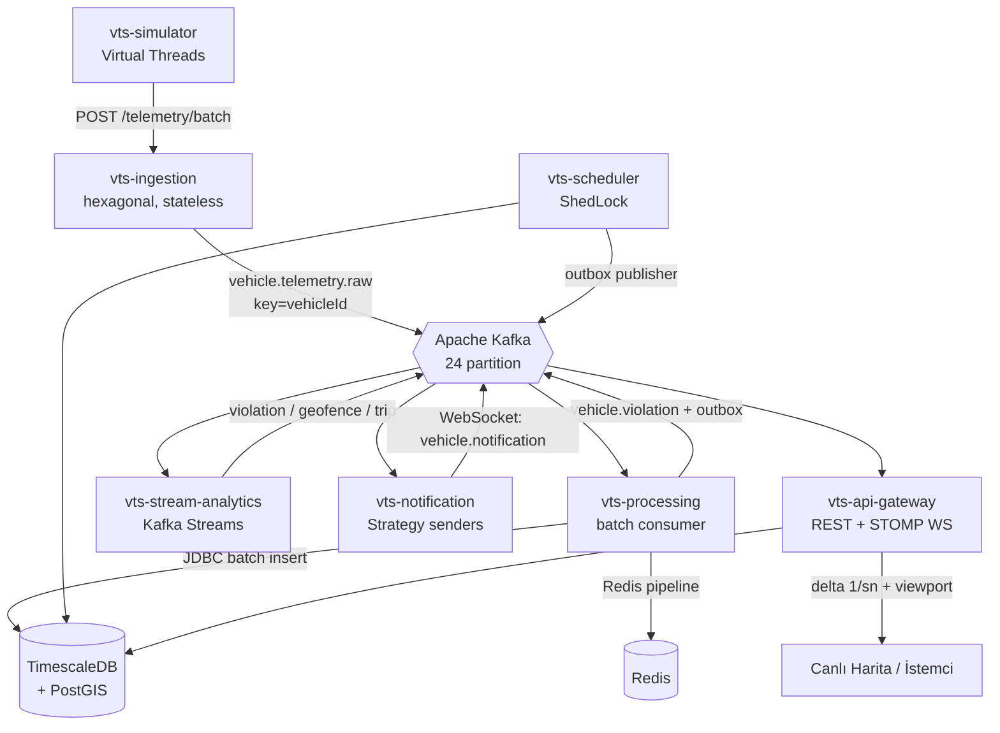

# Araç Takip Simülasyonu (Vehicle Tracking Simulation)

Olay tabanlı (event-driven) filo telematik platformu. Simüle edilen araç
cihazlarından gelen telemetri; ingestion → Kafka → işleme/analitik → bildirim →
API ağ geçidi hattı boyunca akar.

- **Tasarım hedefi:** 1000 araç, ~1000 mesaj/saniye, günde ~86M satır.
- **Çalışma (dev) hedefi:** 100 araç, 5 sn tick (~20 msg/sn).
- **İlke:** Ölçek yalnızca konfigürasyondan gelir; mimari baştan doğru kurulur.

Teknoloji: **Java 21 · Spring Boot 3.3 · Apache Kafka (KRaft) · Kafka Streams ·
TimescaleDB + PostGIS · Redis · çok modüllü Maven monorepo.**

## Mimari



## Modüller

| Modül | Sorumluluk |
|---|---|
| `vts-common` | Event modelleri, topic sabitleri, enum'lar, TenantContext |
| `vts-simulator` | Virtual Threads filo simülatörü; rota interpolasyonu, kasıtlı anomaliler |
| `vts-ingestion-service` | Stateless HTTP giriş; imei→vehicle lookup (Caffeine→Redis→DB), Kafka publish, DLQ |
| `vts-processing-service` | Batch consumer; JDBC batch insert, stateless kurallar, outbox |
| `vts-stream-analytics` | Kafka Streams; stateful kurallar (sert fren, sürekli hız, rölanti, geofence, trip) |
| `vts-notification-service` | Strategy sender'lar, cooldown (Redis), quiet hours |
| `vts-api-gateway` | JWT güvenlik, REST, throttled STOMP WebSocket; şema sahibi (Flyway) |
| `vts-scheduler-service` | ShedLock jobs: offline tespiti, skorlama, bakım, outbox publisher |

## Ölçek kısıtları (baştan doğru kurulan kararlar)

1. **Telemetri tekil `save()` ile yazılmaz** — batch Kafka consumer + `JdbcTemplate.batchUpdate()` + `ON CONFLICT DO NOTHING`; telemetri için JPA entity yok; `reWriteBatchedInserts=true`.
2. **Event başına Redis round-trip yok** — stateful durum Kafka Streams state store (RocksDB); toplu Redis işlemleri pipeline.
3. **WebSocket'e event başına mesaj yok** — gateway in-memory tutar, `@Scheduled(1s)` ile SADECE değişenleri (delta) yayınlar; client viewport (bbox) gönderir.
4. **Kafka partition = 24** (profilden bağımsız) — sonradan artırmak per-vehicle ordering'i ve Streams state store'larını bozar.
5. **Telemetri = TimescaleDB hypertable** — dashboard sorguları ham tabloya değil continuous aggregate'e vurur.
6. **Her tabloda `tenant_id` + Outbox Pattern** baştan.

## Veri modeli

Flyway `V1`–`V15` ile **38 iş tablosu**. Öne çıkanlar:
- `telemetry` **hypertable**: `by_range(ts)` + `by_hash(vehicle_id, 8)`, PK `(vehicle_id, ts)`, FK'siz (batch insert hızı).
- `violation` **hypertable**.
- `vehicle_driver_assignment`: ihlali doğru şoföre atfetmek için zamansal kayıt.
- Continuous aggregate'ler: `telemetry_1min`, `telemetry_hourly`, `violation_daily_summary`.
- Kompresyon + retention politikaları, GIST/BRIN/partial index'ler.

## Çalıştırma

Tüm sistem tek komutla (altyapı + 8 servis):

```bash
docker compose up -d --build
```

Açılan portlar: API gateway **8080**, ingestion 8081, processing 8082,
stream-analytics 8083, notification 8084, simulator 8085, scheduler 8086,
Kafka UI **8090**, Prometheus **9090**, Grafana **3000** (admin/admin),
Postgres 5432, Redis 6379.

Yük profili (1000 araç / 1s, 3 broker override):

```bash
docker compose -f docker-compose.yml -f docker-compose.load.yml up -d
```

### API örnekleri

```bash
# Giriş (dev kullanıcı: admin / password)
TOKEN=$(curl -s -X POST localhost:8080/api/v1/auth/login \
  -H 'Content-Type: application/json' \
  -d '{"username":"admin","password":"password"}' | jq -r .token)

curl localhost:8080/api/v1/vehicles            -H "Authorization: Bearer $TOKEN"
curl localhost:8080/api/v1/dashboard/summary   -H "Authorization: Bearer $TOKEN"
curl "localhost:8080/api/v1/violations?limit=20" -H "Authorization: Bearer $TOKEN"
```

OpenAPI/Swagger UI: `http://localhost:8080/swagger-ui.html`
Canlı harita WebSocket (STOMP): `ws://localhost:8080/ws` → `/topic/fleet/live`,
`/topic/violations`, `/user/queue/notifications`; viewport için `/app/viewport`.

## Profiller

| Profil | Araç | Tick | Chunk | Retention |
|---|---|---|---|---|
| `dev` (varsayılan) | 100 | 5 sn | 1 gün | 30 gün |
| `load` | 1000 | 1 sn | 1 saat | 7 gün |
| `prod` | dış konfig | — | — | — |

## Test

- **Kafka Streams:** `TopologyTestDriver` (harsh braking, idling, geofence enter/exit, trip).
- **Birim testler:** kural motoru, ingestion routing, notification cooldown/quiet-hours, JWT, live-map delta+viewport, simülatör hareketi.
- **Şema doğrulama:** JPA entity'ler canlı TimescaleDB'ye karşı `ddl-auto=validate` (Testcontainers).
- **Uçtan uca:** simulator → Kafka → DB akışı gerçek konteynerlerde doğrulandı (telemetri, last position, ihlaller, GROUP eşik override'ı, şoför atfı).

```bash
mvn test
```

## Gözlemlenebilirlik

Micrometer + Prometheus + Grafana. Metrikler: `telemetry.ingested`,
`telemetry.persisted`, `violation.produced`, `notification.sent`, consumer lag,
DLQ oranı. Grafana'da hazır **"VTS — Fleet Telematics Overview"** dashboard'u
otomatik yüklenir. Her olayda `correlationId` ile yapılandırılmış JSON log.
