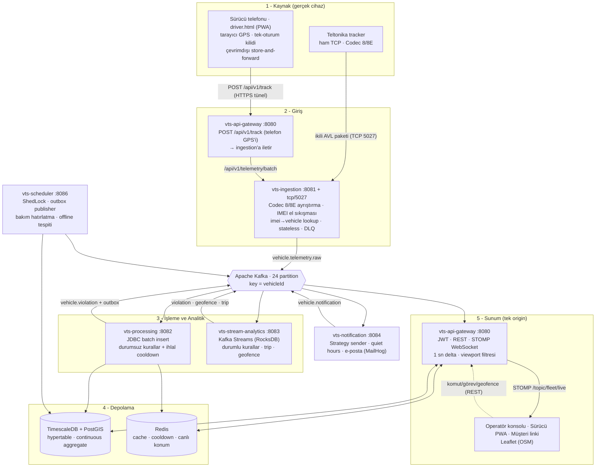

# FleetFlow — Araç Takip Sistemi (Vehicle Tracking)

Olay tabanlı (event-driven) filo telematik platformu. Telemetri **gerçek bir kaynaktan** gelir —
sürücünün telefonundaki tarayıcı-içi GPS izleyici veya ham TCP konuşan bir Teltonika cihazı — ve
**ingestion → Kafka → işleme/analitik → bildirim → API ağ geçidi** hattı boyunca akarak **gerçek
harita üzerinde canlı** izlenir. Üç arayüz aynı gateway'den sunulur: operatör konsolu, sürücü
uygulaması (PWA) ve müşteriye açık takip linki.


---

## İçindekiler

- [Mimari](#mimari)
- [Modüller](#modüller)
- [Arayüzler ve özellikler](#arayüzler-ve-özellikler)
- [Cihaz protokolü (Teltonika Codec 8/8E/12)](#cihaz-protokolü-teltonika-codec-88e12)
- [Olay zamanı (event time)](#olay-zamanı-event-time)
- [Kurallar, ihlaller ve puanlama](#kurallar-ihlaller-ve-puanlama)
- [Veri modeli](#veri-modeli)
- [Ölçek kısıtları](#ölçek-kısıtları)
- [Çalıştırma](#çalıştırma)
- [API örnekleri](#api-örnekleri)
- [Test ve CI](#test-ve-ci)
- [Gözlemlenebilirlik](#gözlemlenebilirlik)

---

## Mimari

Veri tek yönlü akar. Konumun kaynağı artık bir simülatör değil, **sahadaki gerçek cihaz**: sürücünün
telefonu (tarayıcı Geolocation API'si) veya ham TCP konuşan bir tracker. UI'ın tamamı tek serviste
(gateway) barınır — ikinci bir frontend servisi yoktur.


```mermaid
flowchart TB
    subgraph KAYNAK["1 - Kaynak (gerçek cihaz)"]
        PHONE["Sürücü telefonu · driver.html (PWA)<br/>tarayıcı GPS · tek-oturum kilidi<br/>çevrimdışı store-and-forward"]
        HW["Teltonika tracker<br/>ham TCP · Codec 8/8E"]
    end

    subgraph GIRIS["2 - Giriş"]
        GWIN["vts-api-gateway :8080<br/>POST /api/v1/track (telefon GPS'i)<br/>→ ingestion'a iletir"]
        ING["vts-ingestion :8081 + tcp/5027<br/>Codec 8/8E ayrıştırma · IMEI el sıkışması<br/>imei→vehicle lookup · stateless · DLQ"]
    end

    K{{"Apache Kafka · 24 partition<br/>key = vehicleId"}}

    subgraph ISLEME["3 - İşleme ve Analitik"]
        PROC["vts-processing :8082<br/>JDBC batch insert<br/>durumsuz kurallar + ihlal cooldown"]
        STR["vts-stream-analytics :8083<br/>Kafka Streams (RocksDB)<br/>durumlu kurallar · trip · geofence"]
    end

    subgraph DEPO["4 - Depolama"]
        TS[("TimescaleDB + PostGIS<br/>hypertable · continuous aggregate")]
        RD[("Redis<br/>cache · cooldown · canlı konum")]
    end

    NOT["vts-notification :8084<br/>Strategy sender · quiet hours · e-posta (MailHog)"]
    SCH["vts-scheduler :8086<br/>ShedLock · outbox publisher<br/>bakım hatırlatma · offline tespiti"]

    subgraph SUNUM["5 - Sunum (tek origin)"]
        GW["vts-api-gateway :8080<br/>JWT · REST · STOMP WebSocket<br/>1 sn delta · viewport filtresi"]
        UI["Operatör konsolu · Sürücü PWA · Müşteri linki<br/>Leaflet (OSM)"]
    end

    PHONE -->|"POST /api/v1/track (HTTPS tünel)"| GWIN
    HW -->|"ikili AVL paketi (TCP 5027)"| ING
    GWIN -->|"/api/v1/telemetry/batch"| ING
    ING -->|"vehicle.telemetry.raw"| K
    K --> PROC
    K --> STR
    PROC --> TS
    PROC --> RD
    PROC -->|"vehicle.violation + outbox"| K
    STR -->|"violation · geofence · trip"| K
    K --> NOT
    NOT -->|"vehicle.notification"| K
    K --> GW
    GW <--> TS
    GW <--> RD
    SCH --> TS
    SCH --> K
    GW -->|"STOMP /topic/fleet/live"| UI
    UI -.->|"komut/görev/geofence (REST)"| GW
```

### Telefon nasıl telemetriye dönüşür

Tarayıcılar Geolocation API'sini yalnızca **güvenli bağlamda** (HTTPS) ve aynı origin'e açar. Bu
yüzden sürücü sayfası gateway'den sunulur ve fix'lerini gateway'e postalar — tek origin, tünellenecek
tek port. `POST /api/v1/track` ucu **bilinçli olarak kimliksizdir** (bir saha GPS'i JWT taşıyamaz);
gateway her fix'i ingestion'ın batch ucuna iletir, ingestion IMEI'yi araca çözer ve tanınmayan cihazı
isteği düşürmek yerine **DLQ'ya** yazar.

Telefon çevrimdışıyken (tünel koptu, kapsama yok) fix'leri **yerelde biriktirir** ve ağ dönünce
`POST /api/v1/track/batch` ile topluca boşaltır — böylece "uygulama açık" ile "platform veri alıyor"
ayrı cümleler olur. Tek-oturum kilidi (`X-Device-Session`) her fix'te tazelenir: aynı araca başka bir
cihaz girerse mevcut telefon **409** alır ve akışı durdurup yeniden giriş ister.

---

## Modüller

| Modül | Port | Sorumluluk |
|---|---|---|
| `vts-common` | — | Event modelleri, topic sabitleri, enum'lar, TenantContext, ortak Kafka tüketici desteği (deserialization + retry/DLQ), **Teltonika Codec 8/8E + Codec 12 kodek'i** |
| `vts-test-support` | — | Testcontainers yardımcıları: migrasyonlu TimescaleDB, Kafka, Redis. Yalnızca test bağımlılığı |
| `vts-ingestion-service` | 8081 · **5027** | İki giriş: HTTP/JSON batch ve **ham TCP (Codec 8/8E)**; imei→vehicle lookup (Caffeine→Redis→DB), Kafka publish, DLQ, **cihaz oturumları + Codec 12 komut teslimi** |
| `vts-processing-service` | 8082 | Batch consumer; JDBC batch insert, durumsuz kurallar **+ ihlal cooldown**, odometre yazımı, outbox |
| `vts-stream-analytics` | 8083 | Kafka Streams; durumlu kurallar (sert fren, sürekli hız, rölanti, geofence, trip) |
| `vts-notification-service` | 8084 | Strategy sender'lar, cooldown (Redis), quiet hours, e-posta (dev'de MailHog) |
| `vts-api-gateway` | 8080 | JWT güvenlik, REST, STOMP WebSocket, şema sahibi (Flyway) **+ üç arayüzün tamamı** (operatör konsolu, sürücü PWA, müşteri linki), telefon GPS ingress'i |
| `vts-scheduler-service` | 8086 | ShedLock jobs: offline tespiti, bakım hatırlatma, outbox publisher |

> **Kimlik tuzağı:** `vehicle.id` ile plaka numarası aynı değildir; UI her yerde `vehicleId` konuşur,
> cihaz eşlemesi **imei (doğal anahtar)** üzerinden yapılır. Telefon uygulaması araca **plaka + şifre**
> ile giriş yaparak IMEI'sini alır ve akışını o IMEI altında gönderir.

---

## Arayüzler ve özellikler

Üç arayüz de aynı gateway'den, tek origin'den sunulur.

### 1) Operatör konsolu — `/` (`index.html`)

Giriş: `admin` / `password` (JWT arka planda alınır).

#### Canlı harita


- **Canlı harita:** Tüm filo tek WebSocket aboneliğinden beslenir (polling yok); marker kümeleme,
  plaka etiketleri, ihlal/durak renk kodları, viewport (bbox) filtresi.
- **Bölgeler (geofence):** Haritaya **poligon çizerek** yasak/güvenli bölge oluşturma
  (`POST /api/v1/geofences`); silmek yerine `active=false` (ihlal geçmişi bölgeye referans verir).
  Kural motoru listeyi 60 sn'de bir yeniler.
- **Görev atama + ETA:** Araç seçilip haritada hedef tıklanır; sürücüye görev düşer, operatör aktif
  görevleri **canlı ETA** ile izler (haversine, anlık hız). Müşteri linki de hedef + ETA gösterir.
- **Duyuru + mesajlaşma:** Operatör tüm sürücülere genel duyuru yayınlar (banner + çan); araç bazlı
  metin/sesli mesajlaşma (WebSocket). Sağ-üstteki paneller (Bölgeler / Görevler / QR / bildirim /
  duyuru) tek merkezden senkron — aynı anda yalnızca biri açık.

#### Filo, karne, bakım ve araç kontrolleri


- **Filo yönetimi:** Araç ekle/sil, sürücü şifresi ata/göster, CSV filo raporu, plaka arama/filtre.
  Kartlar 5 sn'de bir **yerinde** güncellenir (yeniden kurulmaz → titremez).
- **Araç karnesi:** Son 30 günün ihlallerinden araç/sürücü başına **0–100 güvenlik puanı + A/B/C/D
  notu** ve sıralama (leaderboard, 🥇🥈🥉 ilk üç).
- **Bakım takibi:** Km/tarih tabanlı planlar; **durumu sürücü işaretler** (Bekleniyor → Bakımda →
  Yapıldı), operatör salt-okunur rozet görür.
- **Araç kontrolleri (DVIR):** Sürücünün gönderdiği sefer-öncesi kontrol listeleri; kusurlu maddeler
  kırmızı işaretlenir, "sadece kusurlu" filtresi.

#### Geçmiş oynatma


- **Geçmiş oynatma:** Araç + gün seçilir (**son 30 gün**); günün izi harita üzerinde oynatılır,
  toplam mesafe / ihlal / durak, hız/eco/skor özeti ve CSV dışa aktarma.

### 2) Sürücü uygulaması (PWA) — `/driver.html`

Kurulabilir PWA (manifest + service worker). Giriş: **plaka + şifre** (operatör atar). QR ile
telefona hızlı yönlendirme (`/api/v1/track/config` tünel URL'sini verir).

- **Sürüş:** Canlı GPS akışı (foreground), durum/GPS rozeti, wake-lock; **görev kartı** (hedef,
  "🧭 Yol tarifi" → harita uygulaması, Yola çıktım/Vardım/Tamamla).
- **Harita:** Kendi konumu + rota izi.
- **Mesajlar:** Operatörle metin/sesli mesajlaşma, tek-dokunuş hazır yanıtlar.
- **Duyurular:** Merkez duyuruları (üstten banner + sekme rozeti).
- **Bakım:** Aracın bakım planları (durum işaretleme) + **sefer öncesi araç kontrolü** (6 maddelik
  İyi/Kusurlu listesi + not).

### 3) Müşteri takip linki — `/share.html`

Operatör bir araç için **24 saatlik, JWT'siz** paylaşım tokeni üretir (`POST /api/v1/vehicles/{id}/share`).
Müşteri linki açınca yalnızca o aracın canlı konumunu, aktif görev varsa **hedef işaretini ve ETA'yı**
görür. Süre dolunca link kendiliğinden geçersizleşir.

---

## Cihaz protokolü (Teltonika Codec 8 / 8E / 12)

Telefon HTTP/JSON konuşur; **gerçek donanım** ham TCP konuşur, ikili paket basar, kapsama dışında
kalır ve döndüğünde saatlik geçmişini tek seferde boşaltır. Ingestion'ın **iki kapısı** vardır ve
ikisi de aynı çekirdeğe girer:

| Kanal | Ne için |
|---|---|
| `POST :8081/api/v1/telemetry/batch` (JSON) | Yazılım olan her şeyin sözleşmesi (gateway telefon fix'lerini buraya iletir) |
| **`tcp/5027`** (ikili Codec 8/8E) | Donanımın konuştuğu dil |

```
cihaz → [uzunluk][IMEI ascii]        →  sunucu → 0x01 kabul / 0x00 ret
cihaz → [0000][uzunluk][codec][n][kayıtlar][n][CRC16]
                                     →  sunucu → 4 bayt: alınan kayıt sayısı
```

**ACK protokolün tamamıdır.** Cihaz, sunucu sayıyı onaylayana kadar hiçbir kaydı silmez. ACK
**ayrıştırılan** kayıt sayısını bildirir (iş kabulünü değil); CRC'si tutmayan paket ise **hiç
onaylanmaz** — bozuk iletimi almış gibi yapmak kayıtları temelli kaybettirir. Kodek `vts-common`'da,
çünkü ingestion çözer, karşı taraf üretir; iki yerde yazılsa birbirinden kayardı. Çözücü **Teltonika'nın
belgelenmiş örnek paketine** karşı doğrulanır.

### Komut kanalı: Codec 12 (sunucudan cihaza)

Kanal iki yönlüdür. Operatör serbest metin gönderemez; komut sabit bir **izin listesinden** seçilir
(`GET /api/v1/device-commands/catalogue`): `getgps/getinfo/getver/getstatus`, **`setdigout 1`** (röleyi
keser — araç yolda durur), `setdigout 0`, `cpureset`. Komut **Kafka üzerinden** yayınlanır: bir cihazın
TCP oturumu tek bir ingestion örneğinde yaşar; her örnek her komutu okur (yayın) ve yalnızca soketini
tuttuğu cihaza davranır. Durum `device_command` tablosunda: `PENDING → SENT → ANSWERED`, ayrıca
`TIMEOUT` (cevap yok), `NO_SESSION` (cihaz çevrimdışı), `FAILED`.

---

## Olay zamanı (event time)

Tamponunu boşaltan bir cihazın iki saatlik geçmişi, varsayılan çıkarıcıyla "şimdi olmuş" sayılır.
Sonucu: yolculuk **ortasından kapanır**, 09:00 penceresi 11:00 kayıtlarıyla dolar, salı işlenen ihlal
**çarşambaya** yazılır — hiçbiri hata vermez. `EventTimeExtractor` akış zamanını olayın kendi anına
bağlar. Üstüne iki ayar:

| Ayar | Değer | Neden |
|---|---|---|
| `vts.analytics.event-time.grace` | 15 dk | Pencere kapandıktan sonra gelen ölçüme tanınan süre |
| `vts.analytics.event-time.trip-close-grace` | 15 dk | Kapsama boşluğundaki sessizlik park etmiş araçtan ayırt edilemez; punctuator bu kadar bekler |

Üç yer daha zamanı geriye almayı reddeder: `vehicle_last_position` UPSERT'i (`WHERE ts <= EXCLUDED.ts`),
canlı harita durumu (eski ölçüm markörü geri taşımaz) ve konum önbelleği (1 dk'dan eski ölçüm "şimdiki
konum" sayılmaz). Grace'ten geç gelen ölçüm kaybolmaz; veritabanına ve panolara girer, yalnızca
**pencereli kuralı** kaçırır.

---

## Kurallar, ihlaller ve puanlama

### Kurallar tipe göre uygulanır

Eşikler asla kodda değil, `rule` + `rule_assignment` tablolarında; TENANT/GROUP/VEHICLE_TYPE kapsamında
override edilir. Durumsuz kurallar (hız limiti, düşük yakıt/batarya) processing'de; durumlu kurallar
(sert fren, sürekli hız aşımı, rölanti, geofence giriş/çıkış, trip) stream-analytics'te (Kafka Streams,
RocksDB) hesaplanır. Bir tipin satırı yoksa kuralın kendi varsayılanı geçerlidir.

### Araç/sürücü karnesi

Her araç bir sürücüye (driver_login) karşılık gelir. Karne, **son 30 günün ihlallerinden** bir güvenlik
puanı üretir: 100'den başlar, her ihlal ağırlığınca düşer (ağır ihlal daha çok), A/B/C/D notuna çevrilir
ve sıralanır. İhlali olmayan araç 100 (A) alır. Ayrı bir tablo yoktur — mevcut `violation` verisinden
okuma anında hesaplanır (`GET /api/v1/scorecard`).

### Bakım

`maintenance_plan` km ve/veya tarih tabanlı planlar tutar. **Durumu aracı kullanan sürücü** mobilden
işaretler (`PENDING → IN_PROGRESS → DONE`); "Yapıldı" işaretlenince plan bir sonraki döngüye kaydırılır
(yeni vade servis anındaki odometreden hesaplanır, aksi halde her gecikme aralığı sıkıştırırdı).
Odometre sahte değildir: processing, Teltonika IO 16'yı (toplam odometre) araç satırına **monoton**
olarak yazar — kapsama boşluğundan dönen eski ölçüm kilometreyi geri sarmasın diye.

---

## Veri modeli

Flyway migration'ları ile TimescaleDB + PostGIS şeması. Öne çıkanlar:

- `telemetry` **hypertable**: `by_range(ts)` + `by_hash(vehicle_id)`, PK `(vehicle_id, ts)`, FK'siz
  (batch insert hızı).
- `violation` **hypertable**; `vehicle_last_position` (canlı harita/paylaşım için son konum).
- `geofence`: operatör haritadan poligon çizip kaydeder; silmek yerine `active=false`.
- `maintenance_plan` / `maintenance_record`: sürücü-işaretli durum (`status` kolonu).
- `dispatch_job`: görev atama (hedef lat/lon, `ASSIGNED/EN_ROUTE/ARRIVED/DONE/CANCELLED`).
- `vehicle_inspection`: DVIR kontrol kayıtları (JSONB `items`, `OK/DEFECT`).
- `vehicle_share_token`: 24 saatlik müşteri paylaşım tokeni.
- `driver_login`: araç başına telefon giriş kimliği (plaka + şifre).
- `rule` + `rule_assignment`: eşik/uygulanabilirlik override'ları.
- `device_command`: Codec 12 komut durumu.
- Continuous aggregate'ler: `telemetry_1min`, `telemetry_hourly`, `violation_daily_summary`;
  kompresyon + retention, GIST/BRIN/partial index'ler.

Her tabloda `tenant_id` + **Outbox Pattern** baştan.

---

## Ölçek kısıtları (baştan doğru kurulan kararlar)

1. **Telemetri tekil `save()` ile yazılmaz** — batch Kafka consumer + `JdbcTemplate.batchUpdate()` +
   `ON CONFLICT DO NOTHING`; telemetri için JPA entity yok; `reWriteBatchedInserts=true`.
2. **Event başına Redis round-trip yok** — durumlu state Kafka Streams state store (RocksDB); toplu
   Redis işlemleri pipeline.
3. **WebSocket'e event başına mesaj yok** — gateway in-memory tutar, `@Scheduled(1s)` ile SADECE
   değişenleri (delta) yayınlar; client viewport (bbox) gönderir.
4. **İhlaller okuma başına üretilmez** — üç yerde debounce: durumsuz kurallarda araç+kural cooldown;
   sert frende araç bazlı 120 sn cooldown (RocksDB); sürekli hız aşımında 5 dk'lık tumbling pencere.
5. **Bellek sınırsız bırakılmaz** — servis başına `mem_limit` + `MaxRAMPercentage`; Kafka Streams'te
   tüm RocksDB örnekleri tek ve sınırlı LRU cache + write-buffer manager paylaşır (`BoundedRocksDBConfig`).
6. **Trip mesafesi ham GPS toplamı değildir** — ardışık okumalar arası 2 km'yi aşan adımlar
   *konumlandırma* sayılır ve mesafeye eklenmez.
7. **Kafka partition = 24** (profilden bağımsız) — sonradan artırmak per-vehicle ordering'i bozar.
8. **Telemetri = TimescaleDB hypertable** — dashboard sorguları continuous aggregate'e vurur.
9. **Canlı akış kimliksiz dinlenemez** — STOMP `CONNECT` frame'inde JWT doğrulanır (SockJS handshake
   public kalır; kimlik CONNECT'te kontrol edilir).

---

## Çalıştırma

Tüm sistem tek komutla (altyapı + servisler):

```bash
docker compose up -d --build
```

Ardından tarayıcıdan:

| Arayüz | Adres | Giriş |
|---|---|---|
| **Operatör konsolu** | http://localhost:8080 | `admin` / `password` |
| **Sürücü uygulaması (PWA)** | http://localhost:8080/driver.html | plaka + şifre (operatör atar) |
| Müşteri takip linki | `/share.html?t=<token>` | — (24 sa geçerli) |
| Swagger UI | http://localhost:8080/swagger-ui.html | JWT |
| Kafka UI | http://localhost:8090 | — |
| Prometheus | http://localhost:9090 | — |
| Grafana | http://localhost:3000 | `admin` / `admin` |
| Jaeger (dağıtık izleme) | http://localhost:16686 | — |
| MailHog (dev e-posta) | http://localhost:8025 | — |

Diğer portlar: ingestion 8081 (**+ cihaz kanalı tcp/5027**), processing 8082, stream-analytics 8083,
notification 8084, scheduler 8086, **Postgres 5435**, **Redis 6380**, Kafka 9092.

> Postgres host portu **5435**, Redis **6380**'dir (yerel/diğer projelerle çakışmasın diye). Servisler
> kendi aralarında `postgres:5432` / `redis:6379` kullanmaya devam eder.

### Sürücü telefonuyla test (HTTPS tünel)

Tarayıcı GPS'i güvenli bağlam ister. Yerelde `http://localhost` güvenli sayılır, ama **telefondan**
bağlanmak için bir HTTPS tüneli gerekir (ör. `cloudflared` / `ngrok`). Operatör konsolundaki QR paneli
tünel URL'sini gösterir; sürücü QR'ı okutup plaka + şifre ile girer.

### Yük profili

```bash
docker compose -f docker-compose.yml -f docker-compose.load.yml up -d
```

---

## API örnekleri

```bash
# Operatör girişi (dev: admin / password)
TOKEN=$(curl -s -X POST localhost:8080/api/v1/auth/login \
  -H 'Content-Type: application/json' \
  -d '{"username":"admin","password":"password"}' | jq -r .token)

curl localhost:8080/api/v1/vehicles              -H "Authorization: Bearer $TOKEN"
curl localhost:8080/api/v1/dashboard/summary     -H "Authorization: Bearer $TOKEN"
curl "localhost:8080/api/v1/violations?limit=20"  -H "Authorization: Bearer $TOKEN"
curl localhost:8080/api/v1/scorecard             -H "Authorization: Bearer $TOKEN"   # araç karnesi
curl localhost:8080/api/v1/geofences             -H "Authorization: Bearer $TOKEN"
curl localhost:8080/api/v1/maintenance/plans     -H "Authorization: Bearer $TOKEN"
curl localhost:8080/api/v1/inspections           -H "Authorization: Bearer $TOKEN"   # DVIR
curl localhost:8080/api/v1/jobs                  -H "Authorization: Bearer $TOKEN"   # aktif görevler

# Araç için 24 saatlik müşteri paylaşım linki
curl -X POST localhost:8080/api/v1/vehicles/1/share -H "Authorization: Bearer $TOKEN"
```

**Sürücü tarafı** (public, `X-Device-Session` ile): `POST /api/v1/track/login`,
`POST /api/v1/track` (GPS fix), `POST /api/v1/track/batch` (çevrimdışı boşaltma),
`GET /api/v1/track/job`, `POST /api/v1/track/inspection`, `GET /api/v1/track/maintenance`.

Canlı harita WebSocket (STOMP): `ws://localhost:8080/ws` → `/topic/fleet/live`, `/topic/violations`,
`/user/queue/notifications`; viewport için `/app/viewport`.

---

## Test ve CI

```bash
mvn test      # yalnızca birim testler, Docker gerekmez
mvn verify    # + entegrasyon testleri (Testcontainers), CI'ın çalıştırdığı komut
```

Her push'ta GitHub Actions `mvn verify` koşar (`.github/workflows/ci.yml`). jacoco rapor üretir,
eşik dayatmaz.

**Ne var:** her servisin bean grafiğini gerçek Postgres/Kafka/Redis'e karşı açan **context testleri**;
`FlywayMigrationIT` (migrasyonları hiç görmemiş TimescaleDB'ye); `Codec8CodecTest` (Teltonika örnek
paketi); `TeltonikaTcpIT` (soketten Codec 8E → Kafka, gecikmeli/sırasız zaman damgaları korunur);
`EventTimeTopologyTest` (grace'li/grace'siz aynı girdi); Kafka Streams için `TopologyTestDriver`
(sert fren, rölanti, geofence, trip); kural motoru + cooldown, ingestion routing, JWT, live-map
delta+viewport birim testleri.

> **Windows/Docker tuzağı:** Docker Engine 29, API 1.44'ün altını reddediyor; Testcontainers'ın
> içindeki docker-java 1.32 istiyor ve el sıkışma HTTP 400 ile düşüyor. Kök pom `api.version`'ı
> 1.44'e sabitliyor (`-Ddocker.api.version=...` ile değiştirilebilir).

---

## Gözlemlenebilirlik

Micrometer + Prometheus + Grafana. Metrikler: `telemetry.ingested`, `telemetry.persisted`,
`violation.produced`, `notification.sent`, consumer lag, DLQ oranı; cihaz kanalı için
`device.connections`, `device.records`, `device.record.lateness`, `device.packets.malformed`,
`device.emulator.buffered`, `device.commands.sent/answered`, `device.sessions.open`. Grafana'da hazır
**"VTS — Fleet Telematics Overview"** dashboard'u otomatik yüklenir. Her olayda `correlationId` ile
yapılandırılmış JSON log.

### Dağıtık izleme (Jaeger)

Bir ölçüm birden çok servisten geçtiği için "harita neden geç güncellendi" sorusunun cevabı, tek bir
zaman çizelgesinde görünür (http://localhost:16686). Örnekleme **%2** (`TRACING_SAMPLE_RATE`); Kafka
propagasyonu (`spring.kafka.*.observation-enabled`) olmadan zincir Kafka'da kopar. İzler bellekte
tutulur, kalıcı değildir.
